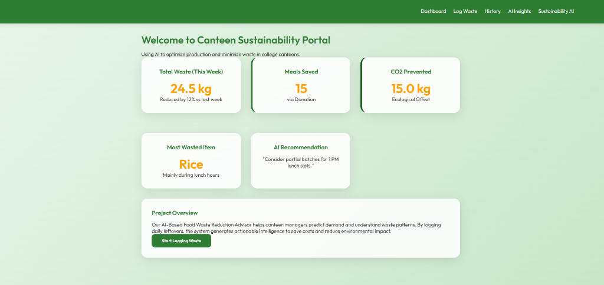
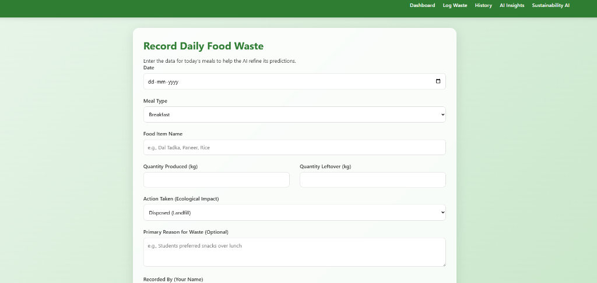
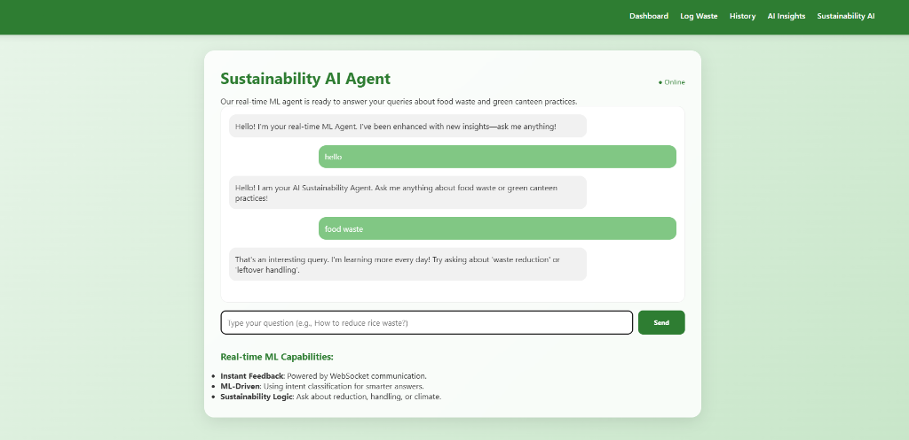

# EcoCanteen | AI Food Waste Reduction Advisor

A smart, AI-powered solution to help college canteens reduce food waste, optimize cooking batches, and minimize their carbon footprint.


*(Add your dashboard screenshot here)*

## 🚀 Features

### 1. 📊 Interactive Dashboard
- Real-time visualization of waste statistics.
- **Ecological Impact Metrics**: Tracks "Meals Saved" (via donation) and "CO2 Prevented".
- **AI Recommendation**: Dynamic suggestions based on the day's logs.

### 2. 📝 Smart Waste Logging
- Log daily food production and leftovers.
- **Diversion Tracking**: Record whether food was Donated, Composted, or Disposed.
- **RAG-Powered Recipe Recommendations**: Instant suggestions for repurposing leftovers (e.g., "Rice" -> "Vegetable Fried Rice").

### 3. 🤖 Sustainability AI Agent
- **Dual-Mode Chatbot**:
    - **Advanced**: Uses IBM Granite (WatsonX) for generative answers (requires API Key).
    - **Offline Fallback**: Robust keyword-based system works out-of-the-box without keys.
- Ask questions like "How to reduce waste?" or "What to do with leftover dal?".

### 4. 📈 History & Receipts
- View full logs of past waste.
- Download digital "Waste Receipts" for compliance records.

## 🛠️ Tech Stack
- **Frontend**: HTML5, CSS3, JavaScript (Vanilla)
- **Backend**: Python (Flask)
- **AI/ML**: 
    - **RAG**: Custom JSON knowledge base for recipes.
    - **LLM**: IBM WatsonX (Granite Model) integration.
- **Real-time**: Flask-SocketIO for the chatbot.

## 📦 Installation & Setup

1.  **Clone the Repository**
    ```bash
    git clone https://github.com/yourusername/food-waste-manager.git
    cd food-waste-manager
    ```

2.  **Install Dependencies**
    ```bash
    pip install -r requirements.txt
    ```

3.  **Run the Application**
    ```bash
    python app.py
    ```
    Access the app at `http://127.0.0.1:5000`.

## ☁️ Deployment

This project includes a `Procfile` and is ready for deployment on platforms like Render, Heroku, or Railway.

1.  **Environment Variables**:
    - If using IBM Granite, set `WATSONX_API_KEY` and `PROJECT_ID` in your deployment environment variables.

## 📸 Screenshots

### Log Waste Input


### Smart Insights & Recipes


### AI Chatbot

